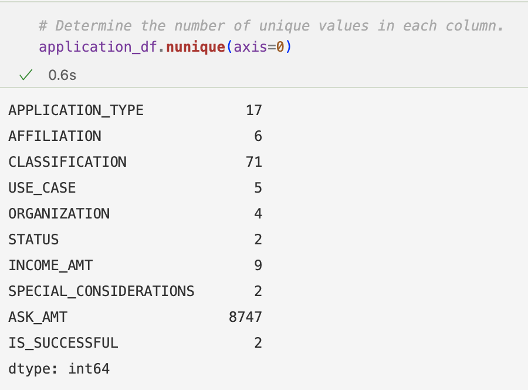
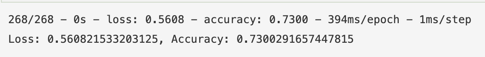
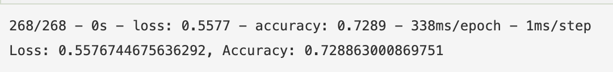
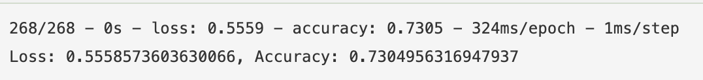
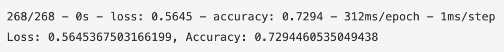
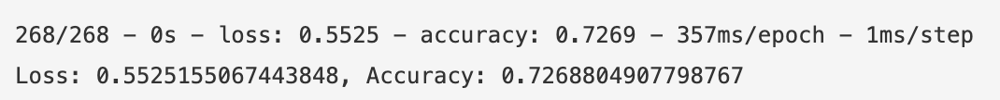

# Neural_Network_Charity_Analysis
Using neural network machine learning to predict which non-profits should be given money by a hypothetical foundation.

## Overview
The purpose of this analysis is to use deep neural network machine learning to predict which non-profits will successfully use money donated to them by a philanthropic foundation, Alphabet Soup. 

### Dataset
The dataset includes over 34,000 nonprofit organizations who were previously granted money and whether or not the money was successfully used.

# Results

## Data Preprocessing

Upon loading the data into a Pandas Dataframe, application_df, the data looks like this:


- The target variable is whether or not the money was used successfully, classified as a 0 (no) or 1 (yes) in the IS_SUCCESSFUL column.
- The feature variables are 'APPLICATION_TYPE', 'AFFILIATION', 'CLASSIFICATION', 'USE_CASE', 'ORGANIZATION', 'INCOME_AMT', and 'SPECIAL_CONSIDERATIONS'
- The variables 'EIN' and 'NAME' are neither targets nor features and were removed from the input data.

The 'APPLICATION_TYPE' and 'CLASSIFICATION' variables both have more than 10 unique values, as seen by the below image. 



After binning the 'APPLICATION_TYPE' and 'CLASSIFICATION' columns (and later also binning the 'INCOME_AMT' column) The ```OneHotEncoder``` module from sklearn was used to encode the categorical data into a numerical array that could be used in a Keras machine learning model.

## Compiling, Training, and Evaluating the Model

### Initial Model Design
- The first model consisted of two layers (with 80 and 30 neurons respectively, both with the 'relu' activation function). The output activation function was the 'sigmoid' function.
- With this model I was only able to achieve an accuracy of 0.7300 which was below the target performance of 0.75.


### Model Optimizaiton Attempts
#### Attempt 1 - Removing Noisy Data
- My first attempt at optimizing the model included binning the "INCOME_AMT" data into two bins - 0 income, and "other", or, an income of greater than zero. Nothing about the model itself was changed.
- This resulted in a slightly lower accuracy of 0.7289 vs 0.7300


#### Attempt 2 - Add Neurons to each Layer
- My second attempt at optimizing this mdoel included adding additional neurons the second  hidden layer so it had 50 neurons instead of 30 neurons. Nothing elsea bout the model was changed.
- This resulted in an accuracy of 0.7305 which is slightly higher than the original model but still below the goal of 0.75


#### Attempt 3 - Add an additional layer
- Next, I added an additional hidden layer to the model. This additional layer, the third layer, had 30 neurons, and 50 neurons remained on the second hidden layer, from attempt 2.
- This actually reduced the accuracy of the model down to 0.7294.


#### Attempt 4 - Activation Function Manipulation
- Finally, I changed the activation functions of the hidden layers from "relu" to "selu" or the Scaled Exponential Linear Unit activation function. I also removed the third hidden layer since the accuracy of the model had decreased from its addition.
- This again reduced the accuracy of the model down to 0.7269 which is the lowest accuracy yet.


## Summary

Despite trying several different model variations with no improvement to the model accuracy, I am recommended trying some different machine learning models along with potentially more pre-processing modifications to produce more accurate results. 
